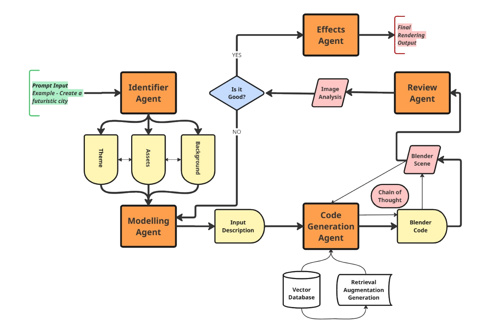
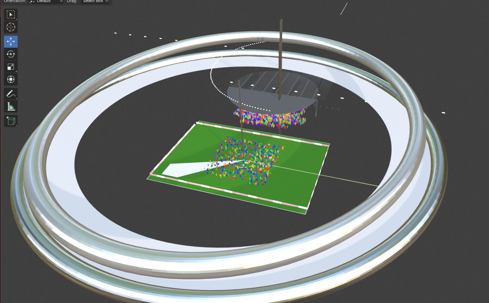
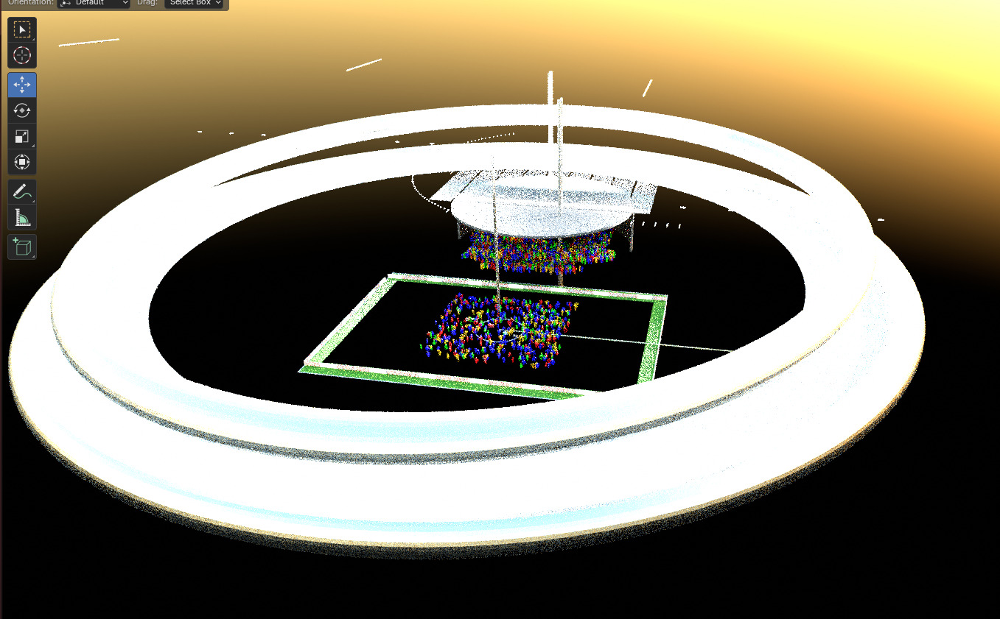
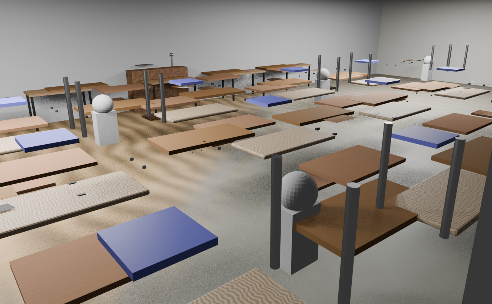

# Verseborn

The project is an application that enables to create full fledged scenes in Blender from a single prompt. It uses agents that interact with each other based on a framework to generate the scenes, iteratively trying to generate a good output.

- Architecture Diagram:

The following are some example outputs that demonstrate the potential of the project.

- Prompt : "Stadium in a night time"

- Prompt : "Stadium in a night time"

- Prompt : "A university Classroom"

# Note:
The project is under development. The outputs are not consistent as they are dependent on the agent's responses, prone to giving poor results at time. It is also time consuming. I believe the potential of the project is huge, requiring a lot of research and tuning.
